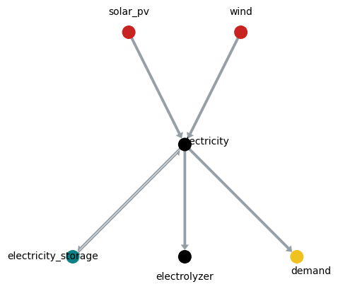

How to use
==========

Overview
--------

A `syfop.Network` consists of nodes and directed edges between nodes forming a directed acyclic
graph. On each edge, a certain commodity flows from one node to another. Each node represents a
technology which can convert the input commodities to output commodities (e.g. electricity to
hydrogen).

For example, here wind and solar PV nodes are used to generate electricity. The electricity is then
directly consumed or used to produce hydrogen:



Note that the node `electricity` does not represent real technology, but is is used only to create
the network topology. That means, no conversion is done in the `electricity` node.

To create a network, first create all node objects. Connections between nodes are defined by
passing other nodes via the `inputs` parameter:

```python
from syfop.network import Network
from syfop.nodes import Node, NodeFixOutput, NodeScalableInput, Storage

# values here are a bit arbitrary but close to real values

wind = NodeScalableInput(
    name="wind",
    input_profile=random_time_series(),
    costs=128 * ureg.EUR / ureg.kW,
)
solar_pv = NodeScalableInput(
    name="solar_pv",
    input_profile=random_time_series(),
    costs=53 * ureg.EUR / ureg.kW,
)
battery = Storage(
    costs=33 * ureg.EUR / ureg.kWh,
    max_charging_speed=0.2,
    storage_loss=0,
    charging_loss=0,
)
electricity = Node(
    name="electricity",
    inputs=[wind, solar_pv],
    input_commodities="electricity",
    costs=0,
    storage=battery,
)
electrolyzer_convert_factor = 0.019 * ureg.kg / ureg.kWh
electrolyzer = Node(
    name="electrolyzer",
    inputs=[electricity],
    input_commodities="electricity",
    size_commodity="hydrogen",
    costs=1 / electrolyzer_convert_factor * 30 * ureg.EUR / ureg.kW,
    convert_factor=electrolyzer_convert_factor,
)
demand = NodeFixOutput(
    name="demand",
    inputs=[electricity],
    input_commodities="electricity",
    output_flow=random_time_series() * ureg.MW,
)

network = Network([wind, solar_pv, electricity, electrolyzer, demand])
```

Descrete time steps are defined the entire network. In each time stamp a certain amount of each
commodity can flow between two connected nodes. Special node types (`NodeFixOutput`, `NodeFixInput`
and `NodeScalableInput`) can be used to define fixed input or output flows. All other flows are
determined automatically.

For each node costs can be defined. Each node with costs also has a size attribute (the capacity of
the technology), which limits the amount of commodities which can flow through the node.

The network is used to generate an optimization model that optimizes the sizes of the nodes and all non-predefined flows between the nodes to minimize total costs. To start the optimization, run:

```python
network.optimize()
```

The results can be inspected by looking at the solution attribute of the [linopy
model](https://linopy.readthedocs.io/en/latest/generated/linopy.model.Model.html):

```
network.model.solution
```

See the next sections and the [API documentation](project:api_reference/index.rst) for more
details.


Node attributes
---------------

Each node has two dictonaries to access input and output flows:

- input_flows
- output_flows

The keys of these dictionaries are the names of the connected nodes, i.e.
`electricity.input_flow["wind"]` contains a time series of the electricity flow from the node
`wind` to the node `electricity`. The same time series can be accessed via
`wind.output_flows["electricity"]`. Note that the unit of the flow time series is amount of
commodity per time, i.e. MW or t/h and not MWh or t. (The interval length between time steps is
only considered for storages and `input_flow_costs`.)

If a node has no input nodes, the `input_flows` dictionary contains only one item with the key
`""`. Similarly, if a node has no output nodes, the `output_flows` dictionary contains only one
item with the key `""`.

Note that the `input_flows` and `output_flows` dictionaries are added to the node objects by the
`Network` object. Therefore, they are not available before the `Network` is created.

Each node stores connected nodes in two lists:

- inputs
- outputs

The commodities flowing over the edges to the connected nodes are stored in two lists:

- input_commodities
- output_commodities

Note that `inputs` and `outputs` are empty lists if no input/output nodes are connected. However,
`input_commodities` and `output_commodities` always contain at least one entry to specify the
commodity flowing in entry nodes or out of exit nodes (leaf nodes). Otherwise the length of
`inputs` and `input_commodities` are equal and the same for `outputs` and `output_commodities`.

If a node has (positive) costs, a size variable is created:

- size

The following node attributes are set via parameters in the constructor of the node class:

- name
- convert_factor
- convert_factors
- costs
- storage
- input_proportions
- input_flow_costs
- size_commodity

See the next sections and the [API documentation](project:api_reference/syfop.node.rst).


Units
-----

To keep track of units, [pint](https://pint.readthedocs.io/) is used for all quantities passed to
syfop objects. Pint works seamlessly with numpy arrays and xarray objects:

```python
from syfop.units import ureg

energy = np.linspace(0, 10) * ureg.MWh
power = energy  / (2 * ureg.h)

print(power.to(ureg.kW))
# outputs: [500.0 2000.0 3500.0 5000.0] kilowatt
```

All user parameters (``costs``, ``input_flow_costs``, ``input_profile``, ``input_flow``,
``output_flow``, ``convert_factor`` etc.) have to be passed with units. All conversions are done
automatically. pint will raise an error if the dimensions of units are not compatible.

Internally, every quantity will be converted to a unit predefined for each commodity. These units
are defined in `syfop.units.default_units` and can be overwritten using the parameter `units` in
the `Network` object. Solutions in `network.model.solution` are given in these units.

Use the unit registry in the `syfop.units` module to add a new unit:

```python
from syfop.units import ureg

ureg.define('USD = 0.93 EUR')
```

There is more information in the [pint
documentation](https://pint.readthedocs.io/en/stable/advanced/defining.html) on how to define
units.
